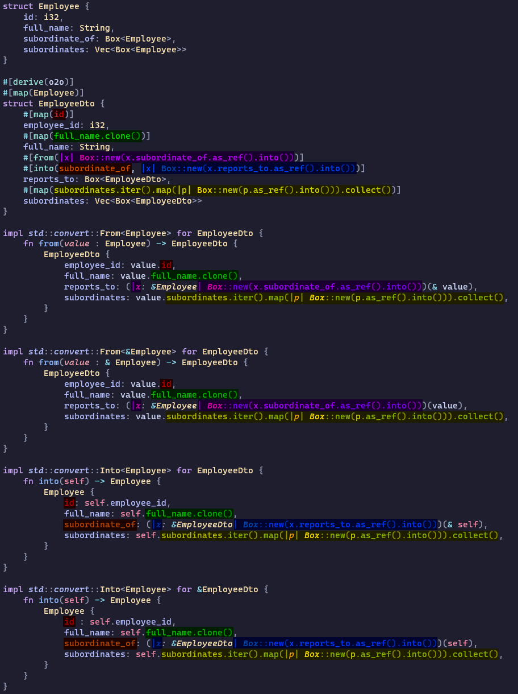

## Object to Object mapper for Rust

**o2o** can implement `std::convert::From<T>`, `std::convert::Into<T>`, and custom `o2o::traits::IntoExisting<T>` traits via procedural macro. It can be best explained through examples, so...

### Examples

#### Simplest Case

``` rust
use o2o::o2o;

struct Entity {
    some_int: i32,
    another_int: i16,
}

#[derive(o2o)]
#[map(Entity)]
struct EntityDto {
    some_int: i32,
    another_int: i16,
}
```

For the above code **o2o** will generate following trait impls:

``` rust
impl std::convert::From<Entity> for EntityDto { ... }
impl std::convert::From<&Entity> for EntityDto { ... }
impl std::convert::Into<Entity> for EntityDto { ... }
impl std::convert::Into<Entity> for &EntityDto { ... }
```

With the above code you should be able to do this:

``` rust
let entity = Entity { some_int: 123, another_int: 321 }
let dto: EntityDto = entity.into();
```
and this:
``` rust
let dto = EntityDto { some_int: 123, another_int: 321 }
let entity: Entity = dto.into();
```
and a couple more things.

#### Different field name

``` rust
struct Entity {
    some_int: i32,
    another_int: i16,
}

#[derive(o2o)]
#[map(Entity)]
struct EntityDto {
    some_int: i32,
    #[map(another_int)]
    different_int: i16,
}
```

#### Different field type

``` rust
struct Entity {
    some_int: i32,
    value: i16,
}

#[derive(o2o)]
#[map(Entity)]
struct EntityDto {
    some_int: i32,
    #[from(value.to_string())] //here `value` is a field of Entity struct
    #[into(value.parse::<i16>().unwrap())] //here `value` is a field of EntityDto struct
    value: String,
}
```

#### Nested structs

``` rust
struct Entity {
    some_int: i32,
    child: Child,
}
struct Child {
    child_int: i32,
}

#[derive(o2o)]
#[map_owned(Entity)]
struct EntityDto {
    some_int: i32,
    #[map(child.into())]
    child: ChildDto
}

#[derive(o2o)]
#[map_owned(Child)]
struct ChildDto {
    child_int: i32,
}
```

#### Nested collection

``` rust
struct Entity {
    some_int: i32,
    children: Vec<Child>,
}
struct Child {
    child_int: i32,
}

#[derive(o2o)]
#[map(Entity)]
struct EntityDto {
    some_int: i32,
    #[map(children.iter().map(|p|p.into()).collect())]
    children: Vec<ChildDto>
}

#[derive(o2o)]
#[map(Child)]
struct ChildDto {
    child_int: i32,
}
```

#### Composit example

``` rust
struct Employee {
    id: i32,
    full_name: String,
    subordinate_of: Box<Employee>,
    subordinates: Vec<Box<Employee>>
}

#[derive(o2o)]
#[map(Employee)]
struct EmployeeDto {
    #[map(id)]
    employee_id: i32,

    #[map(full_name.clone())]
    full_name: String,

    #[from(|x| Box::new(x.subordinate_of.as_ref().into()))]
    #[into(subordinate_of, |x| Box::new(x.reports_to.as_ref().into()))]
    reports_to: Box<EmployeeDto>,

    #[map(subordinates.iter().map(|p|Box::new(p.as_ref().into())).collect())]
    subordinates: Vec<Box<EmployeeDto>>
}
```

### #[map()], #[map_owned()], #[from()], #[into()] etc. explained

**o2o** is able to generate implementation of 6 kinds of traits:

``` rust
// #[from_owned()]
impl std::convert::From<A> for B { ... }

// #[from_ref()]
impl std::convert::From<&A> for B { ... }

// #[owned_into()]
impl std::convert::Into<A> for B { ... }

// #[ref_into()]
impl std::convert::Into<A> for &B { ... }

// #[owned_into_existing()]
impl o2o::traits::IntoExisting<A> for B { ... }

// #[ref_into_existing()]
impl o2o::traits::IntoExisting<A> for &B { ... }
```

And it also has shortcuts for requiring multiple implementations with just one instruction:

|                              | #[map()]           | #[from()]          | #[into()]          | #[map_owned()]     | #[map_ref()]       | #[into_existing()]     |
| ---------------------------- | ------------------ | ------------------ | ------------------ | ------------------ | ------------------ | ---------------------- |
| **#[from_owned()]**          | :heavy_check_mark: | :heavy_check_mark: | :x:                | :heavy_check_mark: | :x:                | :x:                    |
| **#[from_ref()]**            | :heavy_check_mark: | :heavy_check_mark: | :x:                | :x:                | :heavy_check_mark: | :x:                    |
| **#[owned_into()]**          | :heavy_check_mark: | :x:                | :heavy_check_mark: | :heavy_check_mark: | :x:                | :x:                    |
| **#[ref_into()]**            | :heavy_check_mark: | :x:                | :heavy_check_mark: | :x:                | :heavy_check_mark: | :x:                    |
| **#[owned_into_existing()]** | :x:                | :x:                | :x:                | :x:                | :x:                | :heavy_check_mark:     |
| **#[ref_into_existing()]**   | :x:                | :x:                | :x:                | :x:                | :x:                | :heavy_check_mark:     |

So two following pieces of code are equivalent:

```rust
#[derive(o2o)]
#[from_owned(Entity)]
#[from_ref(Entity)]
#[owned_into(Entity)]
#[ref_into(Entity)]
struct EntityDto {
    some_int: i32,
    #[from_owned(another_int)]
    #[from_ref(another_int)]
    #[owned_into(another_int)]
    #[ref_into(another_int)]
    different_int: i16,
}
```

``` rust
#[derive(o2o)]
#[map(Entity)]
struct EntityDto {
    some_int: i32,
    #[map(another_int)]
    different_int: i16,
}
```

### Inline expressions and closures

So far you could have noticed a couple of different types of arguments that can be passed to member level **o2o** instructions:

``` rust
#[map(id)] //Perhaps member name?
#[from(|x| Box::new(x.subordinate_of.as_ref().into()))] //looks like closure??

//What's this weirdness??? (I call them Inline expressions)
#[map(full_name.clone())]
#[map(subordinates.iter().map(|p|Box::new(p.as_ref().into())).collect())]
```

To better understand how they work, take a look at the code from previous 'composite' example, followed by the code generated by **o2o**:



Notice that `#[map(...)]` member level **o2o** instructions are reflected in all four trait impls. `#[from(...)]` and `#[into(...)]` are only to be found in two respective implementations for `From<T>` and `Into<T>` traits.

### Mapping uneven objects

#### Uneven fields

**o2o** is able to handle scenarios when either of the structs has a field that the other struct doesn't have.

For the scenario where you put **o2o** instructions on a struct that contains extra field:
``` rust
struct Person {
    id: i32,
    full_name: String,
    age: i8,
}

#[derive(o2o)]
#[map(Person)]
struct PersonDto {
    id: i32,
    #[map(full_name.clone())]
    full_name: String,
    age: i8,
    // (|_| None) below provides default value when creating PersonDto from Person
    // It could have been omited if we only needed to create Person from PersonDto
    #[ghost(|_| None)]
    zodiac_sign: Option<ZodiacSign>
}
enum ZodiacSign {}
```

In a reverse case, you need to use a struct level `#[ghost()]` instruction:
``` rust
#[derive(o2o)]
#[map(PersonDto)]
#[ghost(zodiac_sign: |_| { None })]
struct Person {
    id: i32,
    #[map(full_name.clone())]
    full_name: String,
    age: i8,
}

struct PersonDto {
    id: i32,
    full_name: String,
    age: i8,
    zodiac_sign: Option<ZodiacSign>
}
enum ZodiacSign {}
```

#### Uneven children

**o2o** is also able to handle scenarios where a child struct (or a hierarchy of structs) on one side is flattened on the other:
``` rust
struct Car {
    number_of_doors: i8,
    vehicle: Vehicle
}
struct Vehicle {
    number_of_seats: i16,
    machine: Machine,
}
struct Machine {
    brand: String,
    year: i16
}

#[derive(o2o)]
#[from(Car)]
#[into_existing(Car)]
struct CarDto {
    number_of_doors: i8,

    #[child(vehicle)]
    number_of_seats: i16,

    #[child(vehicle.machine)]
    #[map_ref(brand.clone())]
    brand: String,

    #[child(vehicle.machine)]
    year: i16
}
```

The reverse case, where you have to put **o2o** insturctions on the side that has less  information, is slightly tricky:
``` rust
use o2o::o2o;
use o2o::traits::IntoExisting;

#[derive(o2o)]
#[map(CarDto)]
struct Car {
    number_of_doors: i8,
    #[parent]
    vehicle: Vehicle
}

#[derive(o2o)]
#[from(CarDto)]
#[into_existing(CarDto)]
struct Vehicle {
    number_of_seats: i16,
    #[parent]
    machine: Machine,
}

#[derive(o2o)]
#[from(CarDto)]
#[into_existing(CarDto)]
struct Machine {
    #[map_ref(brand.clone())]
    brand: String,
    year: i16
}

#[derive(Default)]
struct CarDto {
    number_of_doors: i8,
    number_of_seats: i16,
    brand: String,
    year: i16
}
```

Notice that CarDto has to implement `Default` trait in this case.

### Tuple structs

to be documented...

### Struct kind hints

to be documented...

### Generics

to be documented...

#### Where clauses

to be documented...

### Mapping to multiple structs

to be documented...

### Avoiding proc macro attribute name collisions (alternative instruction syntax)

to be documented...

### #[panic_debug_info] instruction

to be documented...

### Contributions

All issues, questions, pull requests  are extremely welcome.

#### License

<sup>
Licensed under either an <a href="LICENSE-APACHE">Apache License, Version
2.0</a> or <a href="LICENSE-MIT">MIT license</a> at your option.
</sup>

<br>

<sub>
Unless you explicitly state otherwise, any contribution intentionally submitted
for inclusion in this crate by you, as defined in the Apache-2.0 license, shall
be dual licensed as above, without any additional terms or conditions.
</sub>